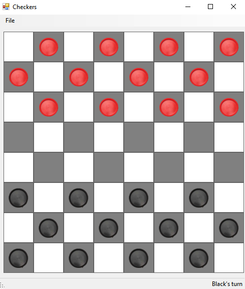
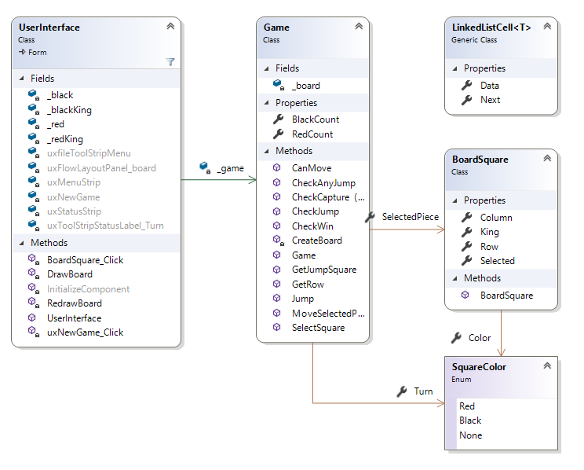
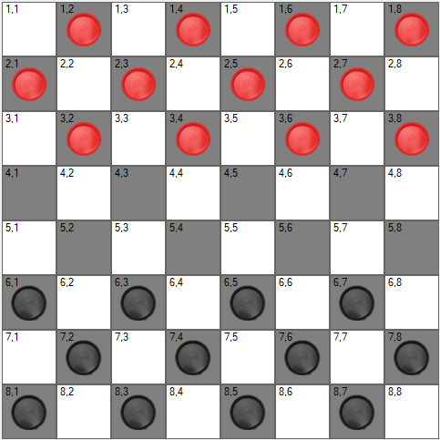

## Functional Requirements

For this assignment, you will be writing a program that can be used  to play checkers (aka English Draughts).  Checkers is a simple game  played on a 8x8 checkered board (32 dark squares and 32 light squares).   There are two colors of pieces, red and black, each being played by one  human player.  Each player starts with 12 pieces. The black piece  player goes first.  Rules of moving, jumping (capturing), and board  layout can be found at [this link](https://www.itsyourturn.com/t_helptopic2030.html) (ignore instructions specific to the site).  The objective of the game is to capture all of the opposing pieces.  Do not worry about ties or draws.

## Starting the Assignment

Create a GitHub repository using [**this URL**](https://classroom.github.com/a/gI9-0iWV) and clone it to your local machine. This solution contains a new Windows Forms Application in which **Form1.cs** has been renamed **UserInterface.cs**.  The pictures used for the checker pieces are in the included **pics** folder.  An obfuscated executable is included a zip folder.

## User Interface

The base interface is very simple. It should be impossible to maximize or otherwise resize this window (set the Form's **MaximizeBox** property to false and its **FormBorderStyle** property to **Fixed3D** to accomplish this). It includes a menu strip that has  File->New Game as menu items. If a user clicks the "New Game" option,  the existing board will be cleared and replaced with a fresh game.   Under the menu strip, a **FlowLayoutPanel** should be  added.  The program will place all of the board squares, with the  pieces, into this panel.  The user will be able to interact with the  board by clicking on a piece then the board square they wish to move it  to. A piece is highlighted once it is selected.  The user can then click  on another square to move the piece or capture an enemy piece.  If the  square the user clicked to move to is not a valid move, a **MessageBox** appears indicating that it is an invalid move.  At the bottom, add a **StatusStrip**  that has the **RightToLeft** property set to Yes.  It should also contain  one label.  This will indicate whose turn it is (ex: "Red's Turn").   Once all of the pieces of either side have been captured, the game is  over and a **MessageBox** appears indicating the winner.  The rest of the interface is generated by your program.



## Software Architecture



The UserInterface class is primarily used for drawing/updating the UI  for when the game is created and when a piece is interacted with.  All  of the actual logic for checkers is contained inside the Game class.   Each square on the checker board will be represented using  BoardSquare's.  This class is also indicates whether or not a square  contains an actual piece.  The enum SquareColor is used to indicate this  information.  

### Representing the Game Board

For this assignment, you will be representing the checkers board using a dictionary of linked lists.  For the dictionary, the **Key** will be the row of the board.  The **Value** will be the first cell of a linked list containing each **BoardSquare**.   This cell should be the left most square (i.e. column) in that row.    This structure can be seen when the board is numbered like the image  below.  Each row has an entry in the dictionary, where the key of each  row is a number 1-8.  Each value in the dictionary is a linked list of  squares, also labeled 1-8, for a given row. The text in each of the below squares are the row-column for each board square.  These are given in this image to help with debugging.  To add this, when drawing the board, simply set the **Text** property.



## Coding Requirements

Specific requirements for the above classes are given in what follows. Feel free to add more **private** methods if you feel it improves the code.  Note that some methods below are public for testing purposes.

### The LinkedListCell< T > Class

This class is given.

### BoardSquare.cs

The class contains the following **properties**:

- **public bool King** 
  - Indicates if this square contains a piece that has been promoted to a King. It contains a default getter/setter and should be initialized to **False**.
- **public SquareColor Color** 
  - Indicates if this square contains a colored piece or if it has none. It contains a default getter/setter.
- **public bool Selected** 
  - Indicates if this square is selected. It contains a default getter/setter and should be initialized to **False**.
- **public int Row** 
  - The row location on the board. It contains a default getter but no setter.
- **public int Column** 
  - The column location on the board. It contains a default getter but no setter.

The class also contains a public constructor that takes in two  integers as parameters.  These represent the row and the column of the **BoardSquare** class.  The *Row* and Column variables defined above should be set to these parameters.

In addition to the **BoardSquare** class, the BoardSquare.cs file should contain an enumerator defined as:

```c#
public enum SquareColor
{
	Red,    
	Black,    
	None
}
```

We have used enumerators like this before, like with ***DialogResult*** when using open/save dialog boxes for files.  Red, Black, and None can be accessed like so: ***SquareColor**.Black*.  These are used to indicate the color of a piece.  ***SquareColor**.None* is used if there is no piece on a square.

### **The Game Class**

The **Game** Class holds most of the logic for checkers. This class contains the following **fields**:

- **private Dictionary<int, LinkedListCell< BoardSquare >> _board**
  - The dictionary that stores the representation of the checker board.  This uses the generic dictionary type contained in *System.Collections.Generic*, and should be initialized to **null**.

This class contains the following **properties**:

- public int RedCount
  - Keeps track of the number of red pieces on the board.  It should have a public getter, but private setter.
- public int BlackCount
  - Keeps track of the number of black pieces on the board.  It should have a public getter, but private setter.

- public BoardSquare SelectedPiece
  - Property to keep track of which piece is currently selected.  This is the piece the user is intending to move. It should have a default getter and setter.
- public SquareColor Turn
  - Property to keep track of whose turn it is. It should have a default getter and setter.

This class contains the following **methods**:

- **private void CreateBoard()**
  - Sets the game board by populating the **_board** dictionary (don't forget to initialize it first!).  Each key of the dictionary is an integer representing a row on the board (1-8) and the value is a **LinkedListCell< BoardSquare >** which is the first **BoardSquare** in  the corresponding row.  Thus, each row of the checker board is  represented as a linked list.  Each cell of the linked list should  contain a new **BoardSquare** set according to the rules of checkers described previously.  In creating the square, be sure to set the **Color**  to indicate any piece, or the lack thereof, that should be placed  there. You should build the board from right to left (**i.e. backwards**), bottom to top.
  - You can build the board using two nested for-loops; in the inner loop, you will be creating a new BoardSquare using the indices  of the loops as parameters to its constructor. You can also use the indices (along with some mod operations) in deciding which BoardSquare should be Red, Black, or None. Make sure to adjust the two count properties above accordingly. 
- **public Game()**
  - The public constructor that calls **CreateBoard** and sets the **Turn** to black.
- **public LinkedListCell< BoardSquare > GetRow(int row)**
  - Returns a LinkedListCell that references the first BoardSquare of the given row if it exists.  Returns null otherwise.
- **private BoardSquare SelectSquare(int row, int col)**
  - Finds and returns the **BoardSquare** that corresponds  to the given row and column.  If the found square has the same color as  the current Turn, the square should be stored in **SelectedPiece.**  Be sure to set the **Selected** property of the **BoardSquare** if this is the case. (*Hint: You will need to search the linked list of the given row to find the cell of the corresponding column.*)
- **private bool CheckCapture(LinkedListCell< BoardSquare >  cell, int targetCol, SquareColor targetColor, out BoardSquare result)**
  -  This method returns whether the row of cells given by **cell** contains a piece of the given **targetColor** in the given column (i.e., **targetColumn**). The **out** parameter should be set to the square in the given column. 
- **private bool CheckCapture(LinkedListCell< BoardSquare > cell, int targetCol, SquareColor targetColor)**
  - This function is the same as the CheckCapture method above, but does  not use an out parameter.  This CheckCapture method should only be  called by the **CheckJump** function below.
- **private bool CheckJump(int enemyRow, int targetRow, int enemyCol, int targetCol, BoardSquare current, SquareColor enemy)**
  - This method looks to see only if a jump is possible, given the location of the enemy (*enemyRow*, *enemyCol*), the location where the piece will jump to (*targetRow*, *targetCol*), and where the piece is at now (*current*).  
  - The enemy AND target should be contained inside the board, if not, return false.  That
    way, we can avoid getting a *KeyNotFoundException* when using  the dictionary’s indexer to obtain the necessary cells for the next step 
  - Use the **CheckCapture**  method described previously to see if the target and enemy  given make a valid jump. (*Note that the target square is empty, hence that call to CheckCapture will have a SquareColor of None.*)  If so, return true.  Otherwise, return false. 
- **private bool CheckAnyJump(BoardSquare current, SquareColor enemy)**
  - This method uses the **CheckJump** to see if *any* jump is possible from the current square given the enemy color.  This should return true as soon as it finds a possible jump. Note that a King piece could potentially jump in four different directions, opposed to a normal piece which can only jump in two directions.
-  **public bool GetJumpSquare(BoardSquare target, SquareColor enemy, out int row, out int col)**
  - This method should first calculate where the enemy piece to jump *should*  be located (the row and column) on the board. (*Remember the King is a special case!*)   
  - You should use the target **BoardSquare**  location to assist in figuring out which direction the user is trying  to jump.  
  - Be sure to enforce the rules on which directions the pieces  can move.  If they are trying to jump in an invalid direction (or too far), the **out** parameters should be set to -1 and then return false.  
  - Otherwise, set the **out** parameters to the location and return true.
- **private bool Jump(BoardSquare current, BoardSquare target, SquareColor enemy, out bool jumpMore)**
  - This function makes the piece jump if the given target is a valid square to jump to.  Note that you may <u>not</u> assume that the target square is within the bounds of the board.  In that case, the method should set the out parameter to false and return false.
  - It will then need to obtain the enemy’s row and column using the **GetJumpSquare** method, but if that method returns false, then we also need to set the out parameter to false and return false.  
  - Then it should use the **CheckCapture** method described above (*the one with the **out** parameter)*  to check the enemy coordinate (retrieved from the **GetJumpSquare** method in the previous step) and target coordinate squares.  The enemy  square should have an opponent piece and the target coordinate should  contain no pieces.  If the capture is valid, decrease the corresponding  number of pieces from the properties described above (*RedCount* or BlackCount).  The enemy **BoardSquare** should be cleared by setting the color to *SquareColor.None*.  After the successful jump is made, the **jumpMore** out parameter should be set to the result of the **CheckAnyJump**  function.  This should check if the new location of the piece can has  any more valid jumps.  Return true to indicate the jump was made.
  - If either the enemy coordinate or the target coordinate given to this function are invalid, **jumpMore** should be set to **false** and false should be returned.
- **public bool CanMove(bool forceJump,BoardSquare targetSquare, SquareColor enemy, out bool jumpMore)**
  - Based on the given target, enemy, and whether or not to force a jump, this method checks to see if a move can be made.  If a jump is being forced, the **Jump** method should be called.  If a jump is made return true; otherwise, set the *out* parameter to false.  Then check for normal moves based off of the target square and the selected piece using the game rules.  If a move is possible, return true (do not make the move here).
- **public bool MoveSelectedPiece(int targetRow, int targetCol)**
  - This function attempts to make a legal move in the target row/column and returns true if a move is made.  
  - First, the target **BoardSquare** should be selected using **SelectSquare**.  If the square is null or **SelectedPiece** is null, there is no valid move, so the method should return false.  Otherwise, if the square returned by **SelectSquare** is equal to **SelectedPiece,** then  a square with a piece on it was selected (return true without moving a  piece).  
  - If the square is empty (meaning its color is None), a piece was selected that was out  of turn (return false).  
  - Otherwise, the user is trying to move a piece.  You need to first check if there is any jump available using the **CheckAnyJump**  function described above.  If there isn't a possible jump from the  currently selected piece,  you need to scan the entire board to see if  there is a jump available for the current player.  If there is,  the  player is trying to make an invalid move.  You should return false to  force the player to select a new piece that has a valid move.  If the **SelectedPiece** piece can move to the target square (i.e., the square returned by **SelectSquare** earlier in this method) or the **SelectedPiece** piece can jump over an enemy (*use the **CanMove** method here!*), make the move by updating the corresponding **BoardSquares**.  The piece should be promoted to a king as outlined in the game rules.   The turn should be changed to the next color if a move was made and if  their are no more jumps (the out parameter from the **Jump** method, false if **Jump** was not called). If a valid move was not made, false should be returned.

### The UserInterface Class

The UserInterface class is responsible for drawing and updating the checker board. This class contains the following **fields**:

- **private Game _game**
  - Stores the current game of checkers. This field should initially be null.
- **private Image _red**
  - Loaded image from "pics\red.png"
  - You can open images using the FromFile function like so: Image.FromFile(@"pics\red.png") 
- **private Image _redKing**
  - Loaded image from "pics\red_king.png"
- **private Image _black**
  - Loaded image from "pics\black.png"
- **private Image _blackKing**
  - Loaded image from "pics\black_king.png"

This class contains the following methods:

- **private void DrawBoard()**
  - This functions draws the checker board in the GUI.  
  - The [**FlowLayoutPanel**](https://docs.microsoft.com/en-us/dotnet/framework/winforms/controls/flowlayoutpanel-control-overview) that contains the board labels should be cleared first of any Controls.  The panel Width should be set to **60 * 8**.  
  - The **Height** should be **30** more than the Width.  The width and height is set dynamically to make the GUI look clean on 4K displays (the VS Designer window is not that great at this).  
  - Then,  the **FlowLayoutPanel** should be loaded with new Labels that represent each square on the game board.  Do this by looping through each LinkedListCell in each row of the game board.  You can get each row by calling the **GetRow** method from the **GameClass**.  Once created, the **Label** should be added to the panel.  That can be done by adding the label to the [Controls](https://docs.microsoft.com/en-us/dotnet/api/system.windows.forms.control.controls?view=netframework-4.7.2#System_Windows_Forms_Control_Controls) property of the layout panel.  The Labels will have the following properties set: 
    - Width: 60
    - Height: 60
    - BackColor: *Color.White* if the sum of Column and Row is even, *Color.Gray* otherwise (mod operations are your friend here!).
    - Margin: Left and Right margin should be 0.  Note that this can be done by using a [*Padding* struct (Links to an external site.)](https://docs.microsoft.com/en-us/dotnet/api/system.windows.forms.padding?view=netframework-4.7.2)  that has Left and Right set to 0, then setting the Margin property to  the padding you just created.  This is because the Margin properties  (Left, Right, Up, and Down) cannot be modified directly.
    - Image: Set to the corresponding image stored in the variables described above base off the color of the **BoardSquare.** 
    - Name: "row,column" (Used if you want extra debugging help)
    - Click: Dynamically bind an event handler described below.  This can be done like so: 
      - squareLabel.Click += new EventHandler(BoardSquare_Click);

- **public UserInterface()**
    - This is the public constructor that is auto generated.  Modify it so  it will create a new game, update whose turn it is in the status bar,  and draw the game board.  These modifications should go after the **InitializeComponent** method call.

- **private void RedrawBoard()**
    - This function should iterate over each row of the board and update each **Label** that represents a board square.  To do this, use the **BoardSquare** data contained in each **LinkedListCell** to update the image(red piece, black piece, king red piece, or king black piece) of the **Label**.  If the **BoardSquare** is selected, the **BackColor** of the **Label** should be updated to *Color.Aqua*, otherwise, it should be returned to is original color.  It should also refresh whose turn it is by updating the status bar.

This class contains the following **event handlers**:

- The new game menu item should have a **click event handler** that initializes a new game.  
- Each **Label** that represents a square on the game board will have a click event handler called **BoardSquare_Click** that is added dynamically when the board is drawn. This method should get the **Label** that was clicked (done by casting the sender as a Label.  
  - Using the **Label** name, which should be "row,column", call the **MakeMove** method that is described in the **Game** class.  If a move is made, the board should be redrawn, and a win should be checked (make use of the properties of the **_game** object).  If the game has been won, the winner should be indicated using a **MessageBox**.  If a move was not made, the user should be informed that they made an invalid move.

## Testing Your Program

Be sure to test win conditions for both sides, and each kind of  move/jump.  To assist in testing your program, it can be helpful to add  text to your board squares to indicate the row and column.  Unit tests are also provided to test PART of the features.  These unit tests are not exhaustive, meaning they do not test every feature/requirement.  The **CheckAnyJump**, **Jump**, and **MoveSelectedPiece** are not unit tested at all since they highly depend on the state of the board through interactions with the GUI.  The unit tests are provided to assist testing helper methods of the more complex methods (like **Jump** and **MoveSelectedPiece**).

## Performance

Each move made in the game should be instant and have relatively no  delay.  There will be a cascade effect when creating a new game.

## Submitting Your Assignment

Be sure to **refresh** your Team Explorer, **commit** all your changes, then **push** your commits to your GitHub repository. Then submit the *entire URL* of the commit that you want graded. There is no need to submit a comment, as you will not have a completion code.

**Important:** If the URL you submit does not contain the 40-hex-digit fingerprint of the commit you want graded, **you will receive a 0**,  as this fingerprint is the only way we can verify that you completed  your code prior to submitting your assignment. We will only grade the  source code that is included in the commit that you submit. Therefore,  be sure that the commit on GitHub contains all six ".cs" files, and that  they are the version you want graded. This is especially important if  you had any trouble committing or pushing your code.